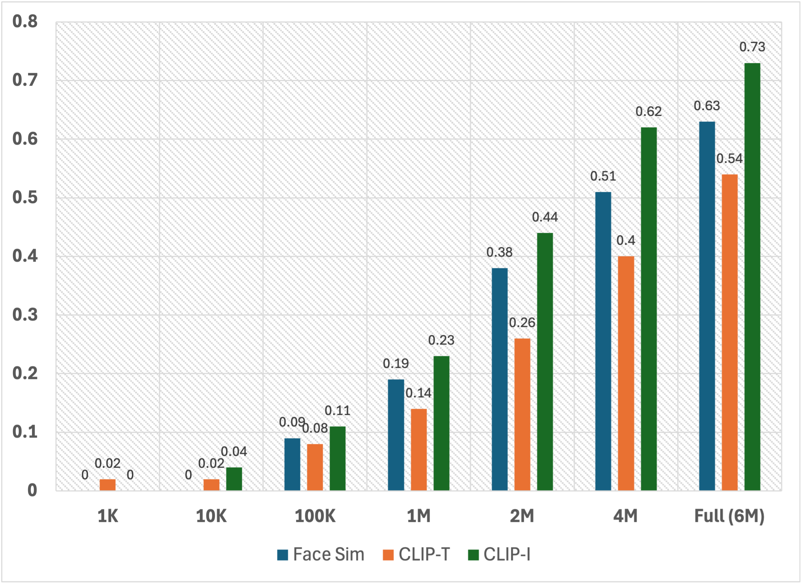

# FaceID-6M: A Large-Scale, Open-Source FaceID Customization Dataset


This repository contains resources referenced in the paper [FaceID-6M: A Large-Scale, Open-Source FaceID Customization Dataset](). 

If you find this repository helpful, please cite the following:


## 🥳 News 

**Stay tuned! More related work will be updated!**
* **[3 Jan, 2025]** The repository is created. 
* **[3 Mar, 2025]** We release the first version of the paper.


## Links
- [FaceID-6M: A Large-Scale, Open-Source FaceID Customization Dataset](#faceid-6m-a-large-scale-open-source-faceid-customization-dataset)
  - [🥳 News](#-news)
  - [Links](#links)
  - [Introduction](#introduction)
  - [Comparison with Previous Works](#comparison-with-previous-works)
    - [FaceID Fidelity](#faceid-fidelity)
    - [Scaling Results](#scaling-results)
  - [Released FaceID-6M dataset](#released-faceid-6m-dataset)
  - [Released FaceID Customization Models](#released-faceid-customization-models)
  - [Usage](#usage)
    - [Training](#training)
      - [Step 1. Download Required Models](#step-1-download-required-models)
      - [Step 2. Download Required Dataset](#step-2-download-required-dataset)
      - [Step 3. Training](#step-3-training)
    - [Inference](#inference)
  - [Contact](#contact)


## Introduction

FaceID-6M, is the first large-scale, open-source faceID dataset containing 6 million high-quality text-image pairs. Filtered from [LAION-5B](https://laion.ai/blog/laion-5b/), which includes billions of diverse and publicly available text-image pairs, FaceID-6M undergoes a rigorous image and text filtering process to ensure dataset quality. For image filtering, we apply a pre-trained face detection model to remove images that lack human faces, contain more than three faces, have low resolution, or feature faces occupying less than 4% of the total image area. For text filtering, we implement a keyword-based strategy to retain descriptions containing human-related terms, including references to people (e.g., man), nationality (e.g., Chinese), ethnicity (e.g., East Asian), professions (e.g., engineer), and names (e.g., Donald Trump). 
Through these cleaning processes, FaceID-6M provides a high-quality dataset optimized for training powerful FaceID customization models, facilitating advancements in the field by offering an open resource for research and development.

<div align="center">
  
</div>


## Comparison with Previous Works


### FaceID Fidelity

<div align="center">
  
</div>

Based on these results, we can infer that the model trained on our FaceID-6M dataset achieves a level of performance comparable to the official InstantID model in maintaining FaceID fidelity. For example, in case 2 and case 3, both the official InstantID model and the FaceID-6M-trained model effectively generate the intended images based on the input. 
This clearly highlights the effectiveness of our FaceID-6M dataset in training robust FaceID customization models.


### Scaling Results

<div align="center">
  
</div>

To evaluate the impact of dataset size on model performance and optimize the trade-off between performance and training cost, we conduct scaling experiments by sampling subsets of different sizes from FaceID-6M. 
The sampled dataset sizes include: (1) 1K, (2) 10K, (3) 100K, (4) 1M, (5) 2M, (6) 4M, and (7) the full dataset (6M).
For the experimental setup, we utilize the [InstantID](https://github.com/instantX-research/InstantID) FaceID customization framework and adhere to the configurations used in the previous quantitative evaluations. The trained models are tested on the subset of [COCO2017](https://cocodataset.org/#detection-2017) test set, with Face Sim, CLIP-T, and CLIP-I as the evaluation metrics.


The results demonstrate a clear correlation between training dataset size and the performance of FaceID customization models.
For example, the Face Sim score increased from 0.38 with 2M training data, to 0.51 with 4M, and further improved to 0.63 when using 6M data.
These results underscore the significant contribution of our FaceID-6M dataset in advancing FaceID customization research, highlighting its importance in driving improvements in the field.


## Released FaceID-6M dataset

We release two versions of our constructed dataset:
1. [FaceID-70K](https://huggingface.co/datasets/Super-shuhe/FaceID-70K): This is a subset of our FaceID-6M by further removing images lower than 1024 pixels either in width or height, consisting approximately 70K text-image pairs. 
2. [FaceID-6M](https://huggingface.co/datasets/Super-shuhe/FaceID-6M): This is our constructed full FaceID customization dataset.

Please note that due to the large file size, we have pre-split it into multiple smaller parts. Before use, please execute the merge and unzip commands to restore the full file. Take the InstantID-FaceID-70K dataset as the example:
1. `cat laion_1024.tar.gz.* > laion_1024.tar.gz`
2. `tar zxvf laion_1024.tar.gz`

**Index**
After restoring the full dataset, you will find large amounts `.png` and `.npy` file, and also a `./face` directory and a `*.jsonl` file:
1. `*.png`: Tmage files
2. `*.npy`: The pre-computed landmarks of the face in the related image, which is necessary to train [InstantID-based models](https://instantid.github.io/). If you don't need that, just ignore them.
3. `./face`: The directory including face files.
4. `*.jsonl`: Descriptions or texts. Ignore the file paths listed in the `.jsonl` file and use the line number instead to locate the corresponding image, face, and `.npy` files. For example, the 0th line in the `.jsonl` file corresponds to `0.png`, `0.npy`, and `./face/0.png`.


## Released FaceID Customization Models

We release two versions of trained InstantID models:
1. [InstantID-FaceID-70K](https://huggingface.co/Super-shuhe/InstantID-FaceID-70K): Model trained on our [FaceID-70K](https://huggingface.co/datasets/Super-shuhe/FaceID-70K) dataset.
2. [InstantID-FaceID-6M](https://huggingface.co/Super-shuhe/InstantID-FaceID-6M): Model trained on our [FaceID-6M](https://huggingface.co/datasets/Super-shuhe/FaceID-6M) dataset.


## Usage

As IP-Adapter has already made its training code publicly available, you can find the details on training and inference [here](https://github.com/tencent-ailab/IP-Adapter). Below, we will provide a detailed explanation of how to train the InstantID model and do inference.


### Training
As the original InstantID repository (https://github.com/InstantID/InstantID) doesn't contain training codes, we follow [this repository](https://github.com/MFaceTech/InstantID?tab=readme-ov-file) to train our own InstantID.

#### Step 1. Download Required Models

You can directly download the model from [Huggingface](https://huggingface.co/InstantX/InstantID).
You also can download the model in python script:

```python
from huggingface_hub import hf_hub_download
hf_hub_download(repo_id="InstantX/InstantID", filename="ControlNetModel/config.json", local_dir="./checkpoints")
hf_hub_download(repo_id="InstantX/InstantID", filename="ControlNetModel/diffusion_pytorch_model.safetensors", local_dir="./checkpoints")
hf_hub_download(repo_id="InstantX/InstantID", filename="ip-adapter.bin", local_dir="./checkpoints")
```

If you cannot access to Huggingface, you can use [hf-mirror](https://hf-mirror.com/) to download models.
```python
export HF_ENDPOINT=https://hf-mirror.com
huggingface-cli download --resume-download InstantX/InstantID --local-dir checkpoints
```

For face encoder, you need to manutally download via this [URL](https://github.com/deepinsight/insightface/issues/1896#issuecomment-1023867304) to `models/antelopev2` as the default link is invalid. Once you have prepared all models, the folder tree should be like:

```
  .
  ├── models
  ├── checkpoints
  ├── ip_adapter
  ├── pipeline_stable_diffusion_xl_instantid.py
  ├── download.py
  ├── download.sh
  ├── get_face_info.py
  ├── infer_from_pkl.py
  ├── infer.py
  ├── train_instantId_sdxl.py
  ├── train_instantId_sdxl.sh
  └── README.md
```


#### Step 2. Download Required Dataset

Please download our released dataset from:
1. [FaceID-70K](https://huggingface.co/datasets/Super-shuhe/FaceID-70K)
2. [FaceID-6M](https://huggingface.co/datasets/Super-shuhe/FaceID-6M)

Please note that due to the large file size, we have pre-split it into multiple smaller parts. Before use, please execute the merge and unzip commands to restore the full file. Take the InstantID-FaceID-70K dataset as the example:
1. `cat laion_1024.tar.gz.* > laion_1024.tar.gz`
2. `tar zxvf laion_1024.tar.gz`


#### Step 3. Training

1. Fill the `MODEL_NAME`, `ENCODER_NAME`, `ADAPTOR_NAME`, `CONTROLNET_NAME`, and `JSON_FILE` into our provided training script `./train_instantId_sdxl.sh`, where:
   1. `MODEL_NAME` refers to the backboned diffusion model, e.g., `stable-diffusion-xl-base-1.0`
   2. `ENCODER_NAME` refers to the downloaded encoder, e.g., `image_encoder`
   3. `ADAPTOR_NAME` and `CONTROLNET_NAME` refers to the pre-trained official InstantID model, e.g., `checkpoints/ip-adapter.bin` and `checkpoints/ControlNetModel`
   4. `JSON_FILE` refers to our released FaceID-70K or FaceID-6M dataset.
2. Run the training scirpt, such as: `bash ./train_instantId_sdxl.sh`


### Inference

1. Fill the `base_model_path`, `face_adapter`, `controlnet_path`, `prompt0`, and `face_image` into our provided inference script `./infer_from_pkl.py`, where:
   1. `base_model_path` refers to the backboned diffusion model, e.g., `stable-diffusion-xl-base-1.0`
   2. `face_adapter` and `controlnet_path` refer to your trained model e.g., `checkpoints/ip-adapter.bin` and `checkpoints/ControlNetModel`
   3. `prompt0` and `face_image` refer to your test sample.
2. Run the training script, such as: `python ./infer_from_pkl.py`


## Contact

If you have any issues or questions about this repo, feel free to contact shuhewang@student.unimelb.edu.au
